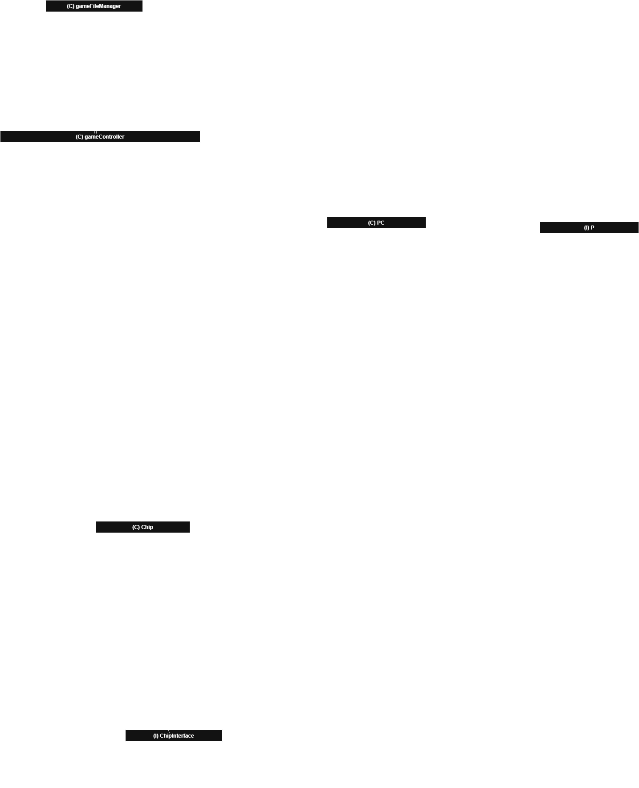

# Dokumentasjon av prosjekt

## Beskrivelse av applikasjon

Denne appen er et spill, der hensikten er å slå så mange motstandere som mulig før en går tom for HP. Man får muligheten til å velge en av tre chips per turn i en dropdown menu, hvor hver av chippene har random rolled damage og type. Med visse type komboer kan man få base damage multiplied, og en må da vurdere om det er verdt å gå for multiplier eller høyere tall.

Typesystemet baserer seg på stein(R) saks(C) papir(P), med neutral(N) lagt inn for litt variasjon. Etter stein saks papir regler, kan en få alt fra 0.5x, 1x til 2x multiplier. Chips er valgt gjennom drop down menyen ved game start, og spilles deretter med Play CHIP.

En timer starter hver turn. Dersom denne utgår, vil spilleren sin turn bli skipped. Man får 3 turns mot motstanderen, før den bruker en random chip mot spilleren. Når motstanderen er slått vil Killcounter holde oversikt over antall slått. Det er mulig å lagre tilstanden til spillet dersom en ønsker.

Foreløpig er det en konflikt mellom loading game og progressbaren. Timeren fungerer korrekt ved (re)Start av game og vanlig spill, men baren og timeren resetter seg ved loading etter en stund. Antakelig er årsaken at flere instanser av timelines kjøres samtidig, som deretter kaller customEnd() metoden selv om den synlige timelinen ikke er i nærheten av ferdig. Dette gjelder også når en (re)Starter spillet mer enn 1 gang.

## Diagram

## Spørsmål

### 1

Interface dekkes i prosjektet av P(layer) klassen og ChipInterface klassen. Hensikten med å ha disse som interface er for å tilrettelegge for potensielle tillegg andre ønsker å lage. Hovedinteraksjonen (dvs. multiplier checks mot type) er da satt som krav i disse klassene ved hjelp av metodene. Dersom en ønsker å lage en ny chip med egne metoder, må den likevel ha en måte å påføre damage og sjekke multiplier. Dersom en ønsker en egen P(layer) med egne conditions for damage, skal denne ha en måte å motta damage på, kunne hente health og armour, samt en måte å bruke chips på.

Opprinnelig var det tenkt å bruke arv både til P(layer)C(haracter) og Chip klassene. Beslutningen om å velge interface ble tatt for fleksibilitet, da ikke alle implementasjoner må nødvendigvis ha samme felt/attributter. Arv er derfor ikke brukt i sluttproduktet, men hadde likevel ledet til samme funksjonalitet, sett i isolasjon uten potensielle tillegg.

Delegering er tilstede både i fillagring og AppController. Selve lagringen/lesingen kalles i AppController, som deretter kalles i gameController, men arbeidet blir utført av gameFileManager klassen. Samme gjelder eksempelvis initGame(), som blir faktisk gjort av gameController. AppController oppdaterer kun sine attributter og App-tekst når denne metoden kalles.

### 2

Som nevnt er ikke arv brukt. Her kunne en hatt en abstrakt superklasse for både P(layer) og ChipInterface. På et vis hadde også dette garantert metodene som kreves for funksjonalitet, ved å ha disse samt attributtene lagt inn i superklassen.

En del av de standard funksjonelle interfacene er heller ikke tatt i bruk, da det ikke ville ha vært hensiktsmessig å ha. Dette gjelder også streams, da en foreach er tilstrekkelig for iterering av Collection-rammeverket.

### 3

Mtp. MVC-prinsippet, er meste av logikken plassert i enten hovedklassene eller gameHjelpeklasser. Denne logikken kalles da av AppController, som også har litt logikk avhengig av hva metodekallet returnerer. Hjelpemetoder kunne ha slanket noe av dette (se kommentarer i koden). Multipliers og forandring av tilstand foregår kun innad hoved/hjelpeklassene. Logikken i AppController kunne ha blitt unngått ved å lage metoder for disse i stedet. Dette ble ikke tatt i betraktning, da meste av fokuset gikk til et funksjonelt sluttprodukt, og AppController er dermed ikke fullstendig uten logikk.

### 4

Hovedfunksjonaliteten ligger i P(layer) health og armour, hvordan disse interagerer med Chips, som deretter utfører damage.

De første to testene kikker kun etter at verdiene til attributtene H og A faller innenfor den bestemte rangen. Chip-funksjonalitet ligger i at det er tre å velge mellom, og at disse blir refreshed til andre tilfeldig genererte chips, som er da hva som testes etter.

Damage-testing er mer omfattende, da denne sjekker om multipliers blir påført  på korrekt vis, samt at armour fungerer som en flat damage reduction(trekkes direkte fra). Her genereres nye chips/players frem til typene matcher et utfall av en multiplier.

Tilslutt testes fillagring og lesing. Både lesing og skriving returnerer strengen som behandles, og denne blir da sammenliknet for å se at overgangen til/fra fil stemmer.
